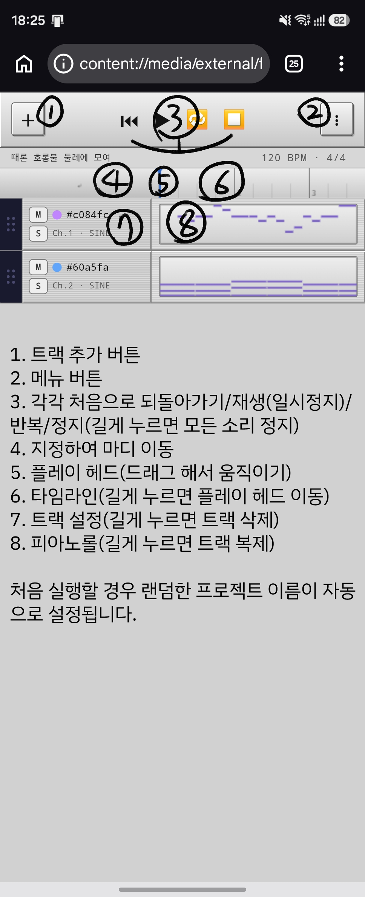
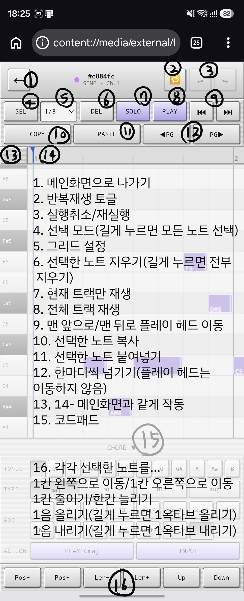

이것은 작곡기입니다.
클로드와 챗지피티(AI들)로 만들었습니다.(단추누르기만 인간이 했습니다.)

고대 프로요 시대에 budgerigar 라는 미디시퀀서가 있었습니다... 

지금은 없습니다. 없어서 모바일로 간단하게 작곡할 수 있는 툴을 만들고 싶었습니다.

http://kaseenya.github.io/jakgokgi/ <-유일한 배포처입니다.

기능...

1. 미디와 WAV, 브라우저에서 지원하는 확장자로 출력이 가능합니다.
2. 일부 버튼은 길게 누르면 다른 작동하는 경우가 있습니다(예시: 선택 버튼을 길게 누르면 전체 선택)
3. 아주 간단하게 키바인딩이 되어있습니다. 컨트롤+Z/스페이스바 등등.
4. 5점터치하면 피아노롤에서도 저장이 가능합니다.

알려진 문제점...
박자의 분자가 분모의 배수가 아닐경우 셋잇단 그리드가 깨지는 버그(설명하기 힘들군요)

